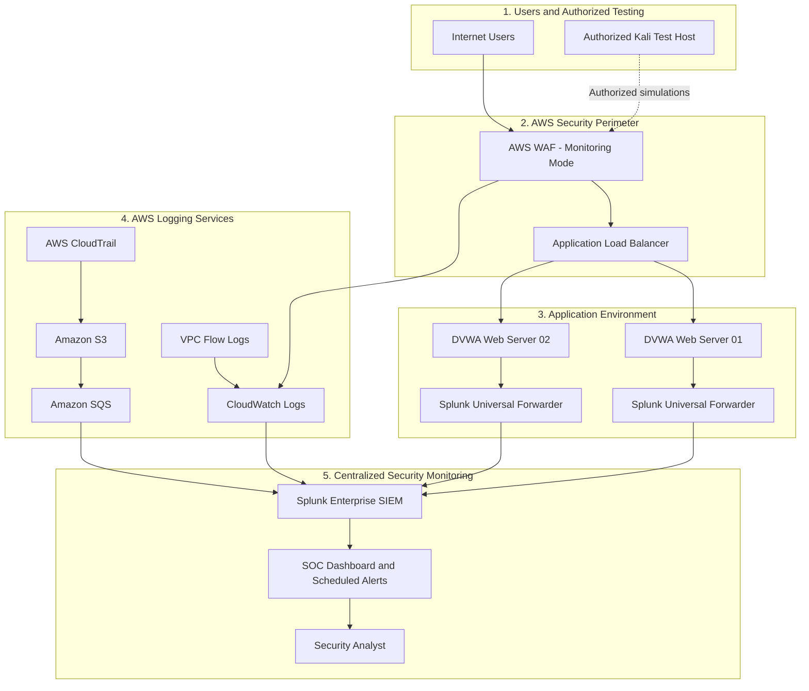
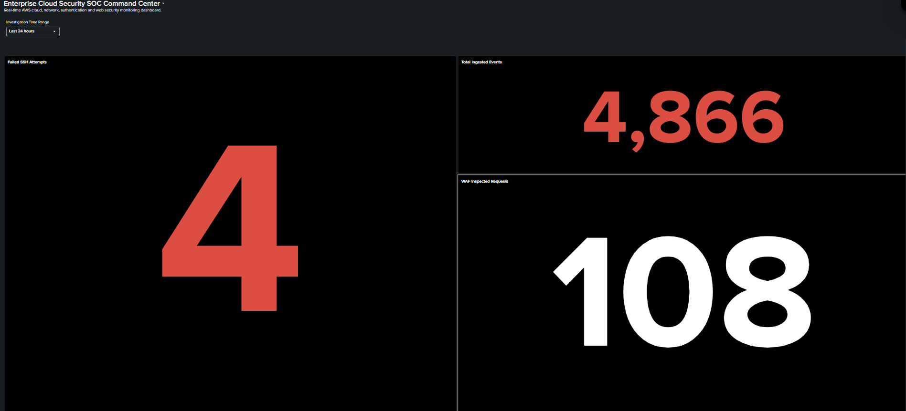
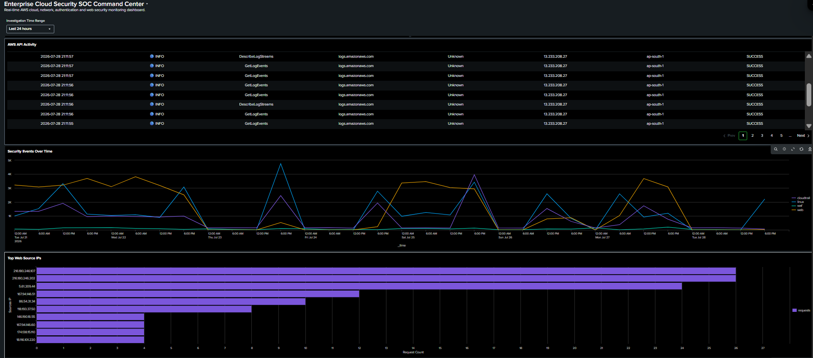
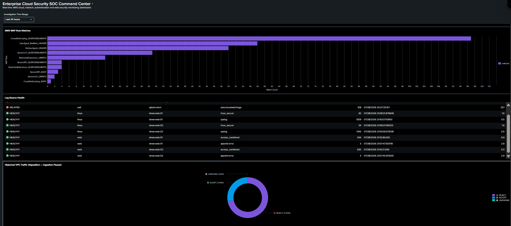
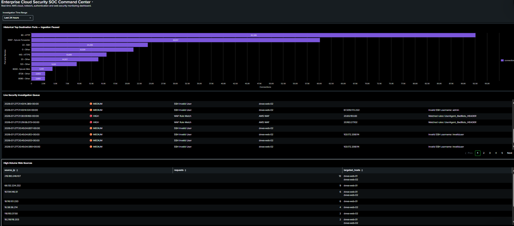
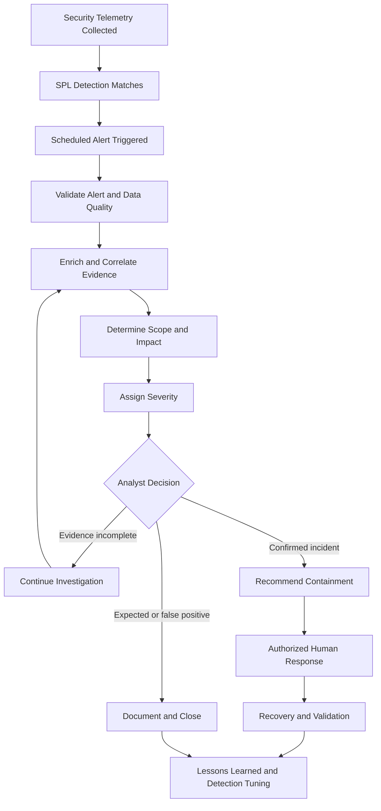

# Enterprise Cloud Security Monitoring & Threat Detection Platform

> An AWS-based security operations lab that centralizes cloud, network, web application, and Linux authentication telemetry in Splunk Enterprise for threat detection, investigation, and analyst-controlled response.


## Project at a Glance

| Area | What was implemented |
|---|---|
| Cloud environment | AWS VPC, EC2, Application Load Balancer, AWS WAF, CloudTrail, CloudWatch Logs, Amazon S3 and Amazon SQS |
| Application tier | Two Ubuntu/Apache servers hosting DVWA behind an ALB |
| Centralized monitoring | Splunk Enterprise with Universal Forwarders and the Splunk Add-on for AWS |
| Security telemetry | CloudTrail, WAF, Apache, Linux authentication, syslog and validated VPC Flow Logs |
| Detection engineering | 10 custom SPL detections mapped to MITRE ATT&CK |
| Validation | Authorized SSH, SQLi, XSS, traversal and web-reconnaissance simulations |
| Response model | Scheduled alerts with human-controlled investigation and response |

## Table of Contents

- [Executive Summary](#executive-summary)
- [Why I Built This Project](#why-i-built-this-project)
- [Business Problem](#business-problem)
- [Architecture](#architecture)
- [Implemented Components](#implemented-components)
- [Log Sources and Indexes](#log-sources-and-indexes)
- [Detection Engineering](#detection-engineering)
- [SOC Dashboard](#soc-dashboard)
- [Authorized Attack Simulations](#authorized-attack-simulations)
- [Incident Investigation Workflow](#incident-investigation-workflow)
- [Security Risk Assessment](#security-risk-assessment)
- [Security Impact](#security-impact)
- [Production Recommendations](#production-recommendations)
- [Limitations](#limitations)
- [Repository Structure](#repository-structure)
- [Reproducing the Project](#reproducing-the-project)

## Executive Summary

This project implements a small-scale enterprise cloud Security Operations Center (SOC) environment on AWS. Two Ubuntu EC2 instances host the Damn Vulnerable Web Application (DVWA) behind an Application Load Balancer (ALB). AWS WAF inspects inbound web traffic, while AWS CloudTrail, VPC Flow Logs, Apache logs, Linux authentication logs, and system logs provide security telemetry.

Splunk Enterprise acts as the centralized SIEM. It receives host telemetry through Splunk Universal Forwarders and AWS telemetry through the Splunk Add-on for AWS. The platform provides dashboards, scheduled alerts, threat hunting searches, and ten custom SPL detections mapped to MITRE ATT&CK.

The environment was validated through authorized attack simulations, including SSH brute force, SQL injection, cross-site scripting, directory traversal, and web reconnaissance. Cloud control-plane detections were validated using available CloudTrail events and non-persistent synthetic detection tests where performing the real action would create unnecessary security risk.

This project intentionally uses analyst-controlled response. It does not automatically block IP addresses, disable accounts, revoke credentials, or modify production infrastructure.

## Why I Built This Project

I built this environment to move beyond isolated security tools and understand how a cloud-security team works end to end. The goal was not simply to install Splunk or enable AWS logging. I wanted to see how application traffic, cloud audit events, operating-system activity and network metadata can be brought together to answer a real incident question.

The project therefore focuses on the complete security lifecycle: building the environment, generating telemetry, writing detection logic, validating alerts, investigating evidence, documenting risk and recommending safer production controls. Where a real test could create unnecessary risk—such as disabling CloudTrail or exposing SSH to the entire internet—I used non-persistent synthetic logic validation instead of weakening the AWS environment.

## Business Problem

AWS environments generate security-relevant events across multiple services and systems. Without centralized collection and correlation, security teams may struggle to answer basic incident-response questions:

- What happened?
- Which user, IP address, host, or AWS identity was involved?
- Was the activity successful or denied?
- Which systems were affected?
- Is the activity isolated or repeated?
- Which MITRE ATT&CK technique best describes the behavior?
- What should an analyst investigate next?

This platform addresses that visibility gap by consolidating cloud, network, web, and authentication telemetry into a single investigation interface.

## Project Objectives

- Build a multi-server AWS web environment behind an Application Load Balancer.
- Protect and monitor the application with AWS WAF.
- Centralize AWS and host logs in Splunk Enterprise.
- Detect web attacks, authentication abuse, IAM changes, cloud logging tampering, and risky network-control modifications.
- Map detection logic to MITRE ATT&CK.
- Create scheduled alerts and a live SOC dashboard.
- Validate detections through controlled and authorized simulations.
- Document operational risks, limitations, and production recommendations.

## Architecture


### Architecture Overview

The platform is organized into five logical layers. Separating the environment this way makes the data flow understandable to non-technical reviewers while keeping the security responsibilities clear for engineers.

1. **Users and authorized testing** generate normal and simulated attack traffic.
2. **AWS security perimeter** inspects requests and distributes them to the application.
3. **Application environment** runs DVWA and generates host and web telemetry.
4. **AWS logging services** collect control-plane, WAF and network evidence.
5. **Splunk SOC layer** centralizes the evidence, runs detections and supports analyst investigation.



### 1. Users and Authorized Testing

The environment receives legitimate application traffic and controlled test traffic. A Kali Linux system is used only against the project owner’s DVWA lab to generate authorized SSH, SQL injection, XSS, directory-traversal and reconnaissance activity. This gives the monitoring platform realistic evidence without testing external or unauthorized systems.

### 2. AWS Security Perimeter

Incoming web requests are inspected by AWS WAF before reaching the Application Load Balancer.

- **AWS WAF** records managed-rule matches associated with suspicious payloads and known bad inputs. It currently operates in monitoring/count mode so matches and false positives can be reviewed before any selected rule is changed to Block.
- **Application Load Balancer** provides one application entry point and distributes traffic between both DVWA servers.

The request path is:

```text
Internet or authorized Kali host → AWS WAF → Application Load Balancer → DVWA server
```

### 3. Application Environment

The application tier contains `dvwa-web-01` and `dvwa-web-02`. Each EC2 instance runs Ubuntu, Apache, DVWA and a Splunk Universal Forwarder.

The servers generate:

- Apache access and error logs
- Linux authentication logs
- SSH activity
- Syslog events

Apache processes the ALB `X-Forwarded-For` header so Splunk can identify the original client rather than recording only the ALB’s private address.

### 4. Host-Telemetry Pipeline

The Universal Forwarder on each web server sends Apache, authentication and operating-system telemetry to Splunk Enterprise:

```text
Web servers → Splunk Universal Forwarders → Splunk Enterprise
```

This pipeline supports web-attack detection, SSH monitoring, host investigation and application troubleshooting.

### 5. CloudTrail Audit Pipeline

CloudTrail records AWS API and control-plane activity such as IAM changes, security-group modifications, administrative actions and logging configuration changes.

```text
AWS CloudTrail → Amazon S3 → Amazon SQS → Splunk Add-on for AWS → Splunk Enterprise
```

- **CloudTrail** generates the audit event.
- **Amazon S3** stores the CloudTrail log objects.
- **Amazon SQS** queues object notifications for reliable collection.
- **Splunk Add-on for AWS** retrieves and parses the data.
- **Splunk Enterprise** indexes, searches and alerts on the activity.

### 6. WAF Telemetry Pipeline

AWS WAF request logs are delivered through CloudWatch Logs:

```text
AWS WAF → CloudWatch Logs → Splunk Add-on for AWS → Splunk Enterprise
```

The telemetry includes the client address, URI, HTTP method, WAF action, managed-rule group and matched rule. The SPL detections explicitly parse nested rule information from `ruleGroupList`.

### 7. VPC Flow Log Pipeline

VPC Flow Logs provide network metadata including source and destination addresses, ports, protocol, packet counts and ACCEPT/REJECT decisions.

```text
VPC Flow Logs → CloudWatch Logs → Splunk Enterprise
```

Continuous ingestion produced excessive volume for the single-node lab SIEM. The Splunk input is therefore paused and enabled during focused network investigations. This is a lab capacity decision; a production platform should preserve network visibility through filtering, aggregation, suitable retention and scalable ingestion.

### 8. Centralized Splunk SOC

Splunk Enterprise provides:

- Centralized indexing and search
- Field extraction and normalization
- Ten custom SPL detections
- Scheduled alerts and throttling
- MITRE ATT&CK mapping
- Log-source health monitoring
- Investigation dashboards
- Evidence review

The security flow is:

```text
Telemetry → Splunk index → SPL detection → Scheduled alert → Analyst investigation
```

Splunk does not automatically disable users, revoke credentials, block addresses or modify AWS infrastructure. The analyst reviews the evidence before recommending or authorizing a response.

### End-to-End Example: SQL Injection

1. The authorized Kali host sends an encoded SQL injection request.
2. AWS WAF inspects and records the request.
3. The ALB forwards it to one DVWA server.
4. Apache records the request in its access log.
5. The Universal Forwarder sends the Apache event to Splunk.
6. WAF telemetry reaches Splunk through CloudWatch Logs.
7. DET-002 decodes the request and identifies the SQL injection pattern.
8. A scheduled alert is generated.
9. The analyst reviews the payload, source, affected host and WAF action before deciding how to respond.

## Implemented Components

| Layer | Component | Purpose |
|---|---|---|
| Perimeter | AWS WAF | Inspects web requests and records managed-rule matches. Currently operated in monitoring/count mode. |
| Traffic distribution | Application Load Balancer | Distributes HTTP requests across two DVWA web servers. |
| Application | Two Ubuntu EC2 web servers | Host Apache and DVWA for controlled security testing. |
| Host telemetry | Splunk Universal Forwarder | Sends Apache, Linux authentication, and syslog data to Splunk. |
| Central SIEM | Splunk Enterprise on EC2 | Provides indexing, search, dashboards, scheduled alerts, and investigations. |
| AWS audit | AWS CloudTrail | Records AWS API and account activity. |
| CloudTrail transport | Amazon S3 and Amazon SQS | Stores CloudTrail files and queues notifications for Splunk ingestion. |
| Web security telemetry | CloudWatch Logs | Stores AWS WAF request logs for ingestion into Splunk. |
| Network telemetry | VPC Flow Logs | Provides network-flow metadata. Splunk ingestion is enabled on demand to control volume. |
| Analyst interface | Splunk Dashboard Studio | Displays operational health, cloud activity, web threats, and investigation data. |

## Log Sources and Indexes

| Splunk index | Primary sourcetype | Data collected | Operational status |
|---|---|---|---|
| `web` | `access_combined`, `apache:error` | Apache requests and application errors | Active |
| `linux` | `linux_secure`, `syslog` | SSH authentication and Linux operating-system activity | Active |
| `cloudtrail` | `aws:cloudtrail` | AWS API, identity, and control-plane activity | Active |
| `waf` | `aws:cloudwatchlogs` | AWS WAF requests and managed-rule matches | Active |
| `vpcflow` | `aws:cloudwatchlogs:vpcflow` | VPC network-flow metadata | Splunk input paused; enabled during network investigations |

### Data-Volume Control

Continuous VPC Flow ingestion generated a disproportionate number of events for the single-node lab SIEM. The Splunk VPC Flow input was therefore paused after validation. AWS-side flow logging can remain available, while Splunk ingestion is enabled during focused network investigations.

This is a lab cost-and-capacity decision, not a recommendation to remove network telemetry from a production SOC.

## Detection Engineering

The project contains ten custom SPL detections. Thresholds and lookback windows are designed for this lab and must be baselined before production use.

| ID | Detection | Primary source | Severity | MITRE ATT&CK | Validation |
|---|---|---|---|---|---|
| DET-001 | SSH Brute Force | Linux authentication logs | High | T1110 – Brute Force | Controlled invalid-user SSH attempts |
| DET-002 | SQL Injection Attempt | Apache access logs | High | T1190 – Exploit Public-Facing Application | Encoded SQLi request sent to DVWA through the ALB |
| DET-003 | Cross-Site Scripting Attempt | Apache access logs | High | T1190 – Exploit Public-Facing Application | Encoded reflected-XSS request sent to DVWA |
| DET-004 | Potential IAM Privilege Escalation | CloudTrail | High/Critical | T1098 – Account Manipulation | Detection logic and available IAM audit events reviewed |
| DET-005 | CloudTrail Logging Modified or Disabled | CloudTrail | High/Critical | T1562.008 – Disable or Modify Cloud Logs | Non-persistent synthetic logic test; no trail disruption performed |
| DET-006 | Security Group Opened to the Internet | CloudTrail | Medium–Critical | T1562.007 – Disable or Modify System Firewall | Non-persistent synthetic logic test; no unsafe exposure created |
| DET-007 | Repeated AWS WAF Rule Matches | AWS WAF logs | Low–High | T1190 – Exploit Public-Facing Application | Repeated authorized web-attack simulations |
| DET-008 | Directory Traversal Attempt | Apache access logs | High | T1190 – Exploit Public-Facing Application | Encoded traversal request sent to DVWA |
| DET-009 | Web Reconnaissance and Enumeration | Apache access logs | Medium | T1595 – Active Scanning | Requests to multiple commonly enumerated paths |
| DET-010 | Successful SSH Login Following Multiple Failures | Linux authentication logs | High | T1110 – Brute Force | Failed logins followed by an authorized key-based login from the same IP |

### Detection Design Principles

- Prefer decoded and normalized request values when matching encoded web payloads.
- Extract source IP addresses explicitly when automatic field extraction is unreliable.
- Preserve raw evidence for analyst review.
- Group repeated events by source, host, identity, or resource.
- Use severity based on behavior and outcome rather than event name alone.
- Distinguish successful cloud changes from failed attempts.
- Account for AWS log-delivery delay with appropriate lookback windows.
- Use throttling to prevent duplicate alert storms.
- Never perform a dangerous cloud change solely to produce a detection screenshot.

### Detection Rule Files

The production SPL searches are available in the [`detections/`](detections/) directory. Each rule produces normalized fields for investigation, including detection ID, severity, source, affected assets, timestamps, and MITRE ATT&CK mapping.

| ID | Detection rule | SPL file |
|---|---|---|
| DET-001 | SSH Brute Force | [View SPL](detections/DET-001-ssh-brute-force.spl) |
| DET-002 | SQL Injection Attempt | [View SPL](detections/DET-002-sql-injection.spl) |
| DET-003 | Cross-Site Scripting Attempt | [View SPL](detections/DET-003-xss-attempt.spl) |
| DET-004 | Potential IAM Privilege Escalation | [View SPL](detections/DET-004-iam-privilege-escalation.spl) |
| DET-005 | CloudTrail Logging Modified or Disabled | [View SPL](detections/DET-005-cloudtrail-tampering.spl) |
| DET-006 | Security Group Opened to the Internet | [View SPL](detections/DET-006-public-security-group.spl) |
| DET-007 | Repeated AWS WAF Rule Matches | [View SPL](detections/DET-007-repeated-waf-matches.spl) |
| DET-008 | Directory Traversal Attempt | [View SPL](detections/DET-008-directory-traversal.spl) |
| DET-009 | Web Reconnaissance and Enumeration | [View SPL](detections/DET-009-web-reconnaissance.spl) |
| DET-010 | Successful SSH Login Following Multiple Failures | [View SPL](detections/DET-010-successful-ssh-after-failures.spl) |

> Detection thresholds and lookback periods are configured for this lab environment. They should be baselined and tuned before production deployment.
## SOC Dashboard

The Splunk Dashboard Studio dashboard provides the following views:

- Failed SSH attempts
- Total ingested events
- AWS WAF inspected requests
- AWS API activity
- Security events over time
- Top external web source IPs
- AWS WAF rule-match distribution
- Active log-source health
- Historical VPC traffic disposition
- Historical top destination ports
- Live security investigation queue
- High-volume web sources
### SOC Dashboard Overview



### Cloud and Web Security Monitoring



### WAF and Log Source Health



### Network and Investigation View



### Dashboard Configuration

The complete Splunk Dashboard Studio configuration is available for review and import:

[Download Splunk SOC Dashboard JSON](dashboard/cloud_security_soc_dashboard.json)

> GitHub displays this file as JSON source code. Import it into Splunk Dashboard Studio to recreate the interactive dashboard.
## Authorized Attack Simulations

Testing was limited to the project owner’s DVWA lab and AWS resources.

| Simulation | Security objective | Expected evidence |
|---|---|---|
| Invalid-user SSH attempts | Validate authentication-abuse monitoring | `linux_secure` events and DET-001 |
| Failed SSH attempts followed by valid login | Validate correlation across failure and success | DET-010 |
| SQL injection request | Validate payload decoding and web-attack detection | Apache event, possible WAF match, DET-002 |
| Cross-site scripting request | Validate encoded payload inspection | Apache event, WAF managed-rule match, DET-003 |
| Directory traversal request | Validate file-path abuse detection | Apache event and DET-008 |
| Common-path enumeration | Validate reconnaissance thresholding | Multiple unique URLs and DET-009 |
| Repeated managed-rule matches | Validate WAF aggregation | DET-007 |

No testing should be directed at systems that the tester does not own or have explicit permission to assess.

## Incident Investigation Workflow

The incident workflow converts raw telemetry into an evidence-based decision. It is deliberately analyst controlled: Splunk detects and presents suspicious behavior, while a human validates the context and authorizes any response.



### Phase 1: Alert Generation

Security telemetry is collected from CloudTrail, AWS WAF, Apache, Linux authentication, syslog and—when enabled—VPC Flow Logs. Scheduled SPL searches inspect this data for suspicious patterns. An alert is created only when the configured behavior, threshold and time-window conditions are met.

### Phase 2: Data and Alert Validation

Before treating a result as an incident, the analyst verifies that the evidence is trustworthy:

- Is the required log source healthy?
- Is the event timestamp correct?
- Was ingestion delayed?
- Were the important fields extracted correctly?
- Is the source address the original client or a private load-balancer address?
- Did the search run over the correct lookback window?
- Was the evidence generated by real telemetry or a documented synthetic test?

This prevents escalation based on stale, incomplete or incorrectly parsed data.

### Phase 3: Initial Triage

The analyst reviews:

- Detection ID, name and severity
- Event time and ingestion time
- Source address and target host
- Username, IAM user, role or principal
- URI, payload or AWS API action
- Event count and time pattern
- Success or failure result
- WAF action and matched rule
- Raw supporting evidence
- MITRE ATT&CK technique

The first objective is to decide whether the activity is expected, suspicious or clearly malicious.

### Phase 4: Evidence Correlation

A single event rarely tells the whole story. Related evidence is correlated across sources:

| Investigation | Correlated evidence |
|---|---|
| Web attack | Apache request + decoded payload + WAF rule match + source IP + target server |
| SSH activity | Failed logins + successful login + source IP + username + target host |
| AWS activity | CloudTrail API call + actor identity + source IP + region + success/failure result |
| Network activity | Source/destination + destination port + protocol + ACCEPT/REJECT decision |

Correlation helps distinguish a confirmed attack from an internet scanner, application error, approved administrative action or false positive.

### Phase 5: Scope and Impact

The analyst determines:

- Which systems, identities or AWS resources were targeted?
- Did the activity succeed?
- How many assets were affected?
- Did it continue after the initial alert?
- Was a privileged identity involved?
- Was security logging or a network control modified?
- Could confidentiality, integrity or availability be affected?
- Is similar activity visible from other sources?

These questions establish the likely blast radius and business impact.

### Phase 6: Severity Assignment

Severity is based on evidence, success, privilege and potential impact—not only the detection name.

| Severity | Meaning | Example |
|---|---|---|
| Low | Limited suspicious activity with minimal observed impact | A small number of WAF Count-mode matches |
| Medium | Repeated or unusual behavior requiring analyst review | Web reconnaissance across multiple paths |
| High | Strong evidence of an attack or unauthorized-access attempt | SQLi, XSS, traversal or SSH brute force |
| Critical | A successful action that weakens a major security control or creates broad exposure | CloudTrail disabled or a sensitive service opened publicly |

### Phase 7: Analyst Decision

The analyst selects one of three outcomes:

#### Expected Activity or False Positive

- Record why the activity is legitimate.
- Preserve the supporting evidence.
- Close the alert.
- Tune the detection only when the same benign behavior is likely to recur.

#### Suspicious but Inconclusive

- Expand the search window.
- Review additional data sources.
- Compare the activity with historical behavior.
- Identify missing evidence.
- Continue monitoring or escalate for deeper investigation.

#### Confirmed Incident

- Record the affected assets and identities.
- Preserve relevant evidence.
- Recommend proportionate containment.
- Obtain authorization before making changes.
- Track the case through recovery and closure.

### Phase 8: Containment and Recovery

This project does not perform automatic containment. In a production environment, approved actions might include:

- Restricting a confirmed malicious source
- Moving a tested WAF rule from Count to Block
- Correcting an unsafe security-group rule
- Rotating exposed credentials
- Disabling a compromised identity
- Isolating an affected host
- Restoring modified logging controls

Every action should be authorized, documented, proportionate to the confirmed risk and reversible where practical.

### Phase 9: Closure and Improvement

Before closing an investigation, the analyst records:

- What happened and when
- How it was detected
- Which systems or identities were affected
- Evidence reviewed
- Severity and potential impact
- Response actions taken
- Remaining risks
- Required logging or detection improvements

The final step is to tune the detection, update the investigation procedure and verify that all required telemetry remains healthy.

### Investigation Example: Successful SSH Login After Failures

1. DET-010 identifies several failed SSH attempts followed by a successful login.
2. The analyst confirms that the failures and success came from the same source and targeted the same host.
3. The username, authentication method and event sequence are reviewed.
4. Historical activity from the source is checked.
5. The analyst determines whether the success was an authorized test or possible compromise.
6. If unauthorized, credential protection and host investigation are recommended.
7. The evidence and final decision are documented before closure or escalation.

## Security Risk Assessment

| Risk | Evidence or condition | Potential impact | Current control | Residual risk | Recommendation |
|---|---|---|---|---|---|
| DVWA is intentionally vulnerable | Application supports controlled exploitation | Unauthorized access or compromise if exposed broadly | Lab-only purpose, WAF visibility, centralized logging | High if left internet-accessible | Restrict source ranges, stop instances when not testing, never use production data, and destroy the lab when complete |
| WAF is in monitoring/count mode | Requests are logged but not necessarily blocked | Known malicious requests may reach DVWA | Managed-rule visibility and Splunk alerting | High for an internet-facing vulnerable app | Review false positives, then move selected validated rules to Block mode using a staged change process |
| HTTP is used at the ALB | Browser displays an insecure connection | Traffic can be intercepted or modified | Lab scope only | Medium | Use an ACM certificate and HTTPS listener; redirect HTTP to HTTPS |
| VPC Flow ingestion is paused in Splunk | High event volume affected SIEM stability | Reduced real-time network visibility | AWS-side logging and on-demand ingestion | Medium | Apply targeted flow-log filters, shorter retention, summary indexing, or a scalable ingestion tier |
| Single Splunk EC2 instance | One system performs search, indexing, and dashboards | SIEM outage creates a monitoring gap | Boot-start, resource checks, and lab maintenance | Medium–High | Use EBS snapshots, configuration backups, health alarms, and separate Splunk roles for production |
| WAF and CloudWatch delivery delay | WAF events may arrive later than host logs | Short searches can miss recent activity | One-hour WAF detection lookback and alert throttling | Medium | Monitor ingestion latency and tune lookbacks based on measured delay |
| Root or highly privileged AWS activity | CloudTrail may record privileged actors | Account-wide compromise if credentials are abused | CloudTrail monitoring and IAM detections | High | Enable root MFA, remove root access keys, use least-privilege roles, and alert on root activity |
| Public administration interfaces | SSH or Splunk Web may be reachable from the internet | Brute force, exploitation, or unauthorized access | Security groups and authentication logs | High if broadly exposed | Restrict to a trusted IP or VPN, use key-only SSH, disable password login, and avoid exposing Splunk Web publicly |
| Sensitive information in evidence | Screenshots may contain account IDs, ARNs, IPs, or resource names | Information disclosure and attacker reconnaissance | Manual redaction before publishing | Medium | Use sanitized evidence and automated secret scanning before every GitHub commit |
| Alert thresholds are lab-specific | Small test volumes differ from enterprise baselines | False positives or missed attacks | Controlled validation | Medium | Establish production baselines, tune thresholds, document exceptions, and measure detection quality |

## Security Impact

The platform provides the following measurable engineering outcomes without relying on unsupported claims:

- Centralized four active security-data domains: AWS control plane, AWS WAF, Linux authentication/system activity, and Apache web activity.
- Validated ten custom SPL detections across identity, web, and cloud-security use cases.
- Correlated failed and successful SSH activity by source and host.
- Preserved decoded web-request evidence for investigation.
- Identified AWS-managed WAF rules triggered during controlled simulations.
- Implemented health monitoring for active log sources.
- Added scheduled alerts with throttling to reduce duplicate notifications.
- Documented data-ingestion constraints and deliberately paused a high-volume source rather than allowing it to destabilize the SIEM.

## Production Recommendations

### Immediate

1. Restrict SSH and Splunk Web access to a trusted IP, VPN, or bastion.
2. Enforce key-based SSH and disable password authentication.
3. Add HTTPS to the ALB using AWS Certificate Manager.
4. Review WAF Count-mode matches and move validated protections to Block mode.
5. Enable MFA for privileged identities and avoid routine root-user activity.
6. Configure EBS snapshots and Splunk configuration backups.
7. Add CloudWatch alarms for EC2 health, disk usage, memory pressure, and service availability.

### Near Term

1. Tune detections against an established baseline.
2. Filter VPC Flow Logs to security-relevant traffic before continuous ingestion.
3. Add asset criticality, environment, owner, and business-service context.
4. Create documented triage playbooks for every detection.
5. Add approved email, ticketing, or chat notifications.
6. Test restore procedures for Splunk configuration and indexed data.
7. Add secret scanning and repository protection to the GitHub workflow.

### Long Term

1. Deploy infrastructure through reviewed Terraform modules.
2. Evaluate Amazon GuardDuty after cost and operational approval.
3. Separate Splunk search, indexing, and collection roles for scale and resilience.
4. Add a controlled SOAR workflow with explicit analyst approval.
5. Introduce detection-as-code testing and version-controlled deployment.
6. Add continuous validation using safe, repeatable security test cases.

These are roadmap items and are not represented as completed features.

## Limitations

- The environment is a lab, not a production deployment.
- DVWA is intentionally insecure.
- AWS WAF is currently used for monitoring/count visibility.
- VPC Flow ingestion into Splunk is paused except during investigations.
- The Splunk deployment is a single-node architecture.
- Some cloud detections remain quiet unless the corresponding administrative action occurs.
- Synthetic tests validate SPL output logic but do not prove end-to-end ingestion of an event that was never generated.
- GuardDuty, Terraform, Kubernetes, AI analysis, and automated containment are not implemented.
- Detection thresholds require tuning before enterprise use.

## Repository Structure

```text
Enterprise-Cloud-Security-Monitoring-Platform/
├── README.md
├── architecture/
│   ├── aws-soc-architecture-3d.png
│   └── aws-soc-architecture.cloudcraft
├── dashboard/
│   └── cloud_security_soc_dashboard.json
├── detections/
│   ├── DET-001-ssh-brute-force.spl
│   ├── DET-002-sql-injection.spl
│   ├── DET-003-xss-attempt.spl
│   ├── DET-004-iam-privilege-escalation.spl
│   ├── DET-005-cloudtrail-tampering.spl
│   ├── DET-006-public-security-group.spl
│   ├── DET-007-repeated-waf-matches.spl
│   ├── DET-008-directory-traversal.spl
│   ├── DET-009-web-reconnaissance.spl
│   └── DET-010-successful-ssh-after-failures.spl
├── screenshots/
│   ├── architecture/
│   ├── aws/
│   ├── dashboard/
│   └── detections/
└── docs/
    └── detection-validation.md
```

## Reproducing the Project

### Prerequisites

- An authorized AWS account and isolated lab environment
- Two Ubuntu EC2 web servers
- One EC2 instance for Splunk Enterprise
- Application Load Balancer
- AWS WAF
- CloudTrail, Amazon S3, Amazon SQS, and CloudWatch Logs
- Splunk Enterprise
- Splunk Universal Forwarder
- Splunk Add-on for AWS
- Kali Linux or another explicitly authorized test host

### Deployment Sequence

1. Create the VPC, subnets, route tables, internet connectivity, and security groups.
2. Deploy two Ubuntu web servers and install Apache and DVWA.
3. Create an ALB, register both instances, and validate target health.
4. Associate AWS WAF with the ALB and begin in Count/monitoring mode.
5. Deploy Splunk Enterprise and restrict management access.
6. Install Universal Forwarders and configure Apache, authentication, and syslog monitoring.
7. Enable CloudTrail and deliver logs through S3 and SQS to Splunk.
8. Enable WAF logging through CloudWatch Logs and configure the Splunk AWS input.
9. Enable VPC Flow Logs and validate on-demand ingestion.
10. Create indexes, field extractions, dashboard panels, saved searches, and scheduled alerts.
11. Run only authorized simulations and record validation evidence.
12. Stop or remove lab resources when testing is complete.

Detailed deployment values such as account IDs, IP addresses, credentials, ARNs, tokens, and private keys must never be committed to this repository.

## Importing the Dashboard

1. Open Splunk Dashboard Studio.
2. Create a new dashboard.
3. Open the dashboard source editor.
4. Copy the sanitized JSON from `dashboard/cloud_security_soc_dashboard.json`.
5. Validate data-source names, index names, and time tokens.
6. Save the dashboard.

The dashboard assumes the index and sourcetype names documented in this README. Adjust them when deploying into another environment.

## Using the Detection Files

Each `.spl` file contains the production search for one detection.

Recommended alert settings:

- Schedule: every five minutes
- Trigger condition: result count greater than zero
- Trigger mode: once per search
- Throttling: normally 30 minutes using the relevant source, identity, host, or resource
- Action: add to Splunk Triggered Alerts
- Response: analyst review before containment

Do not use the synthetic `makeresults` searches as production detections.

## Evidence Handling

Public screenshots must be reviewed and redacted before upload. Remove:

- AWS account IDs
- Access-key identifiers and secrets
- Public and private IP addresses when disclosure is unnecessary
- Full IAM user and role ARNs
- EC2 instance IDs
- S3 bucket names
- SQS queue URLs
- ALB DNS names
- Splunk session information
- Webhook URLs
- Private-key names or contents

## Cost and Resource Management

This lab is not intended to run continuously.

- Stop EC2 instances when the lab is not in use.
- Review EBS, snapshot, CloudWatch, WAF, S3, SQS, and data-transfer charges.
- Use AWS Budgets and billing alerts.
- Control high-volume telemetry before enabling continuous SIEM ingestion.
- Delete unused resources after preserving sanitized evidence and configuration backups.

## Disclaimer

This repository is for defensive-security education and authorized testing. DVWA and all attack simulations must be used only in an isolated environment owned by the tester or covered by explicit written authorization.

## Author

**Parakh Shinde**  
Cloud Security and SOC Engineering Portfolio Project

## License

This project is released under the MIT License. Third-party products, icons, and trademarks remain the property of their respective owners.
