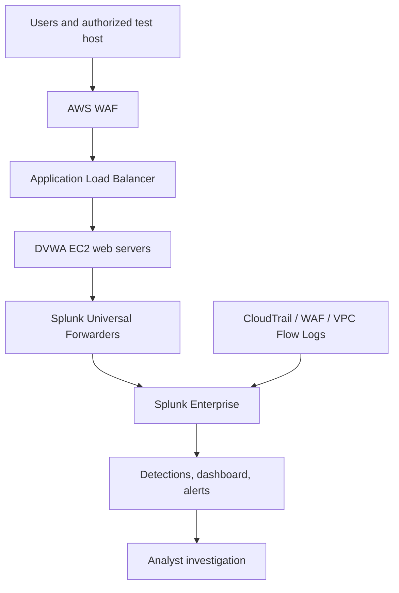

# Enterprise Cloud Security Monitoring and Threat Detection Platform

> AWS and Splunk security-operations lab for cloud audit monitoring, web attack detection, host telemetry, analyst triage, and detection-as-code validation.

[](https://github.com/Parakh-Shinde/Enterprise-Cloud-Security-Monitoring-Platform/actions/workflows/terraform-security.yml)
[](https://github.com/Parakh-Shinde/Enterprise-Cloud-Security-Monitoring-Platform/actions/workflows/detection-quality.yml)


## Overview

This project builds a small AWS security monitoring environment and uses Splunk Enterprise as the investigation layer. It collects AWS control-plane events, WAF telemetry, Apache logs, Linux authentication logs, syslog, and focused VPC Flow Log evidence. Ten custom SPL detections map suspicious activity to MITRE ATT&CK and produce analyst-facing fields for investigation.

The lab is intentionally analyst-controlled. It does not automatically block IP addresses, disable identities, revoke credentials, or modify infrastructure. Detection output is used to guide human review and response decisions.

## What Was Implemented

| Area | Implementation |
| --- | --- |
| Cloud foundation | AWS VPC, public subnets, EC2, Application Load Balancer, AWS WAF, CloudTrail, CloudWatch Logs, S3, SQS |
| Application lab | Two Ubuntu/Apache DVWA servers behind an ALB |
| SIEM | Splunk Enterprise with Universal Forwarders and Splunk Add-on for AWS |
| Telemetry | CloudTrail, AWS WAF, Apache, Linux authentication, syslog, focused VPC Flow Logs |
| Detection engineering | 10 SPL detections mapped to MITRE ATT&CK |
| Automation | Terraform security checks and SPL quality validation through GitHub Actions |
| Analyst workflow | Dashboard, scheduled alerts, runbook, case study, and risk assessment |

## Architecture



```mermaid
flowchart TD
    U["Users and authorized test host"] --> W["AWS WAF"]
    W --> A["Application Load Balancer"]
    A --> E["DVWA EC2 web servers"]
    E --> F["Splunk Universal Forwarders"]
    F --> S["Splunk Enterprise"]
    C["CloudTrail / WAF / VPC Flow Logs"] --> S
    S --> D["Detections, dashboard, alerts"]
    D --> H["Analyst investigation"]
```

## Detection Catalog

| ID | Detection | Source | ATT&CK mapping | Validation method |
| --- | --- | --- | --- | --- |
| DET-001 | SSH brute force | Linux auth logs | T1110 | Controlled invalid-user SSH attempts |
| DET-002 | SQL injection attempt | Apache logs | T1190 | Encoded SQLi request against DVWA |
| DET-003 | Cross-site scripting attempt | Apache logs | T1190 | Encoded XSS request against DVWA |
| DET-004 | Potential IAM privilege escalation | CloudTrail | T1098 | Detection logic and available IAM audit events reviewed |
| DET-005 | CloudTrail logging modified or disabled | CloudTrail | T1562.008 | Non-persistent synthetic logic test |
| DET-006 | Security group opened to the internet | CloudTrail | T1562.007 | Non-persistent synthetic logic test |
| DET-007 | Repeated AWS WAF rule matches | AWS WAF logs | T1190 | Repeated authorized web-attack simulations |
| DET-008 | Directory traversal attempt | Apache logs | T1190 | Encoded traversal request against DVWA |
| DET-009 | Web reconnaissance and enumeration | Apache logs | T1595 | Requests to commonly enumerated paths |
| DET-010 | Successful SSH login after multiple failures | Linux auth logs | T1110 | Failed logins followed by authorized key-based login |

Detection files are stored in [`detections/`](detections/). Each SPL rule returns normalized fields such as detection ID, severity, source, affected host or resource, evidence, and MITRE ATT&CK mapping.

## Evidence and Documentation

| Artifact | Purpose |
| --- | --- |
| [`docs/detection-validation.md`](docs/detection-validation.md) | Rule-by-rule validation method, results, limitations, and tuning guidance |
| [`detections/README.md`](detections/README.md) | Detection catalog and SPL rule documentation |
| [`docs/incident-response-runbook.md`](docs/incident-response-runbook.md) | Analyst triage, evidence preservation, containment approval, and closure workflow |
| [`docs/incident-case-study.md`](docs/incident-case-study.md) | Coordinated web-attack investigation across Apache and WAF evidence |
| [`docs/threat-model.md`](docs/threat-model.md) | Threat model, trust boundaries, and risk register |
| [`docs/security-control-mapping.md`](docs/security-control-mapping.md) | NIST CSF, CIS, CIS AWS, and MITRE ATT&CK mapping |
| [`terraform/`](terraform/) | Reproducible AWS lab foundation |
| [`dashboard/cloud_security_soc_dashboard.json`](dashboard/cloud_security_soc_dashboard.json) | Splunk Dashboard Studio source |

## Detection-as-Code Validation

The repository includes Python checks that validate all production SPL files. The validator checks detection ID consistency, index usage, lookback configuration, severity fields, MITRE ATT&CK format, final analyst-facing output, and accidental use of synthetic `makeresults` searches.

```bash
python scripts/validate_detections.py
```

GitHub Actions runs the same checks when detection content changes.

## Reproduce the Lab

### Prerequisites

- Authorized AWS account used only for lab work
- Splunk Enterprise
- Splunk Universal Forwarder
- Splunk Add-on for AWS
- Terraform
- Kali Linux or another authorized test host

### High-Level Deployment Sequence

1. Review [`terraform/README.md`](terraform/README.md), estimated costs, and trusted administrator CIDR.
2. Deploy the VPC, EC2, ALB, WAF, CloudTrail, S3, SQS, CloudWatch Logs, and VPC Flow Log foundation.
3. Install DVWA and Apache on the two web servers.
4. Install Splunk Enterprise and restrict management access.
5. Install Universal Forwarders and enable Apache, authentication, and syslog collection.
6. Configure AWS telemetry ingestion through the Splunk Add-on for AWS.
7. Import the dashboard from `dashboard/cloud_security_soc_dashboard.json`.
8. Create scheduled alerts from the SPL files in `detections/`.
9. Run only authorized simulations and document validation evidence.
10. Stop or destroy lab resources when testing is complete.

## Security Design Choices

- WAF is initially operated in Count mode so matches can be reviewed before blocking.
- VPC Flow Log ingestion into Splunk is enabled during focused investigations to avoid destabilizing the single-node lab SIEM.
- CloudTrail and WAF delivery delays are handled through wider lookback windows and throttling.
- Synthetic tests are labelled when a real cloud action would create unnecessary risk.
- Response remains analyst-controlled; containment is recommended only after evidence review.

## Production Recommendations

- Restrict SSH and Splunk Web to a trusted IP, VPN, or bastion.
- Enforce key-based SSH and disable password login.
- Add HTTPS to the ALB using AWS Certificate Manager.
- Review WAF Count-mode results before changing selected rules to Block.
- Add MFA and least-privilege roles for privileged AWS identities.
- Create backup and restore procedures for Splunk configuration and evidence.
- Baseline detection thresholds with real environment traffic before production alerting.
- Use scalable ingestion and retention planning before continuous VPC Flow Log ingestion.

## Limitations

- This is a lab, not a production SOC.
- DVWA is intentionally vulnerable and must remain isolated.
- WAF is used for monitoring/count visibility by default.
- VPC Flow Log ingestion is not continuously active in Splunk.
- Splunk runs as a single-node lab deployment.
- Some cloud detections require corresponding administrative activity before they produce real events.
- Synthetic logic tests validate SPL behavior but do not prove end-to-end ingestion for an event that was not generated.
- Detection thresholds are lab-specific and require tuning before enterprise use.

## Responsible Use

Use this project only in environments you own or are explicitly authorized to test. Do not publish credentials, account IDs, public IPs, private keys, tokens, ARNs, bucket names, queue URLs, or unredacted security logs.

## Author

**Parakh Shinde**  
Cloud Security | Detection Engineering | SOC | Incident Response

- Portfolio: [parakh-shinde.github.io](https://parakh-shinde.github.io/)
- GitHub: [Parakh-Shinde](https://github.com/Parakh-Shinde)
- LinkedIn: [parakh-shinde](https://www.linkedin.com/in/parakh-shinde/)

## License

This project is released under the MIT License. Third-party products, icons, and trademarks remain the property of their respective owners.
