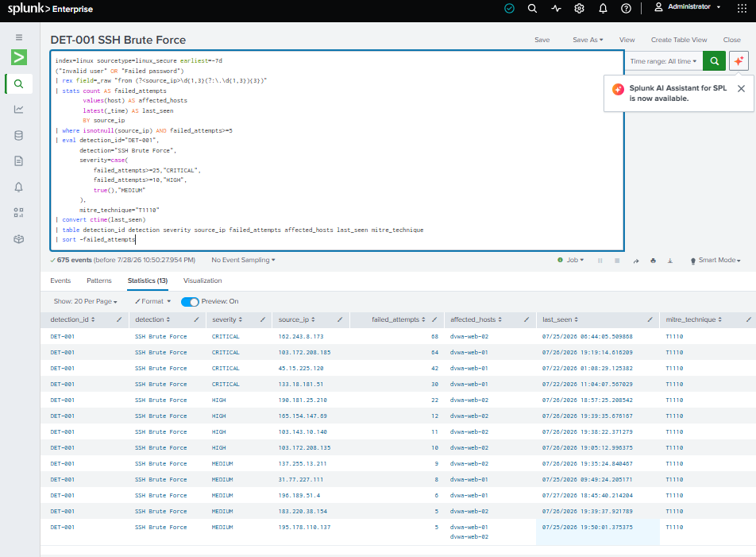
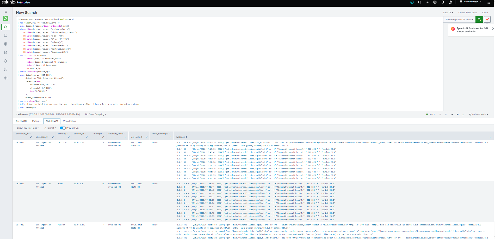

# Detection Validation Report

## Document Control

| Field | Value |
|---|---|
| Project | Enterprise Cloud Security Monitoring Platform |
| Environment | Authorized AWS security lab |
| SIEM | Splunk Enterprise |
| Validation date | 2026-07-29 |
| Detection set | DET-001 through DET-010 |
| Primary log sources | Linux authentication, Apache access, AWS CloudTrail, AWS WAF |
| Response model | Analyst-reviewed; no automated containment |

## Purpose

This report documents how the project's custom Splunk detections were tested and what level of confidence each validation provides. It distinguishes:

- **End-to-end validation** — an authorized action generated telemetry, the data was ingested by Splunk, and the detection returned the expected result.
- **Synthetic logic validation** — representative events were created with Splunk `makeresults` to test high-risk logic without changing production-like security controls.
- **Partial validation** — source data and search logic were reviewed, but the complete behavior was not safely exercised end to end.

This distinction is intentional. A successful synthetic test proves that the search logic handles the test data; it does not prove that every upstream AWS event, field extraction, transport path, or ingestion delay has been validated.

## Safety and Evidence Handling

- Testing was limited to infrastructure owned and authorized for this lab.
- DVWA was used as the intentionally vulnerable application.
- No CloudTrail trail was disabled or deleted.
- No security group was intentionally left exposed to the public internet.
- No IAM privilege-escalation action was performed solely to create an alert.
- Public IP addresses, AWS account identifiers, host secrets, and credentials must be sanitized before screenshots are committed.
- Detection results require analyst review before any containment action.

## Validation Summary

| ID | Detection | Source | Validation method | Status | MITRE ATT&CK |
|---|---|---|---|---|---|
| DET-001 | SSH Brute Force | `linux` / `linux_secure` | Controlled invalid-user SSH attempts | End-to-end validated | T1110 |
| DET-002 | SQL Injection Attempt | `web` / `access_combined` | Encoded SQLi request sent to DVWA through the ALB | End-to-end validated | T1190 |
| DET-003 | Cross-Site Scripting Attempt | `web` / `access_combined` | Encoded reflected-XSS request sent to DVWA | End-to-end validated | T1190 |
| DET-004 | Potential IAM Privilege Escalation | `cloudtrail` / `aws:cloudtrail` | Logic and available IAM audit events reviewed | Partially validated | T1098 |
| DET-005 | CloudTrail Logging Modified or Disabled | `cloudtrail` / `aws:cloudtrail` | Non-persistent `makeresults` event | Synthetic logic validated | T1562.008 |
| DET-006 | Security Group Opened to the Internet | `cloudtrail` / `aws:cloudtrail` | Non-persistent `makeresults` event | Synthetic logic validated | T1562.007 |
| DET-007 | Repeated AWS WAF Rule Matches | `waf` / `aws:cloudwatchlogs` | Repeated authorized web-attack simulations | End-to-end validated | T1190 |
| DET-008 | Directory Traversal Attempt | `web` / `access_combined` | Encoded traversal request sent to DVWA | End-to-end validated | T1190 |
| DET-009 | Web Reconnaissance and Enumeration | `web` / `access_combined` | Requests sent to multiple commonly enumerated paths | End-to-end validated | T1595 |
| DET-010 | Successful SSH Login Following Multiple Failures | `linux` / `linux_secure` | Failed logins followed by an authorized key-based login | End-to-end validated | T1110 |

## Common Acceptance Criteria

A detection is considered end-to-end validated when all applicable criteria are met:

1. The authorized test action is recorded by the expected source.
2. The event arrives in the intended Splunk index and sourcetype.
3. Required fields are extracted or derived correctly.
4. The search returns the expected detection ID and event context.
5. Severity and threshold behavior match the SPL.
6. The result contains sufficient evidence for analyst triage.
7. A sanitized screenshot or search export is retained as evidence.

## Detailed Validation Results

### DET-001 — SSH Brute Force

**Objective:** Identify a source IP producing repeated invalid-user or failed-password SSH authentication events.

**Test method:** Controlled invalid usernames were submitted to the lab web servers over SSH. The test was stopped after enough failures were generated to exceed the five-event threshold.

**Expected result:** The search groups failures by `source_ip`, identifies the affected hosts, assigns severity according to the attempt count, and maps the activity to T1110.

**Observed result:** Linux authentication events were ingested into `index=linux` with `sourcetype=linux_secure`, and the detection returned the test source with the expected failed-attempt count.

**False-positive considerations:**

- Vulnerability scanners and asset-discovery platforms
- Users entering outdated credentials
- Automated administration systems using a retired account

**Recommended tuning:**

- Exclude approved scanner and bastion addresses through a lookup.
- Baseline normal authentication failures before changing thresholds.
- Add username diversity and destination-host count as risk modifiers.

**Validation evidence:**

<details>
<summary>View sanitized DET-001 evidence</summary>



</details>
---

### DET-002 — SQL Injection Attempt

**Objective:** Detect common SQL injection syntax after URL decoding Apache requests.

**Test method:** An encoded SQL injection payload was sent through the Application Load Balancer to the authorized DVWA endpoint.

**Expected result:** The request is decoded, matched against SQLi indicators, grouped by source IP, and reported with the targeted hosts and request evidence.

**Observed result:** Apache access events appeared in `index=web` with `sourcetype=access_combined`, and the detection returned the authorized test request.

**False-positive considerations:**

- Security scanners and penetration tests
- Documentation or training pages containing SQL syntax
- Legitimate requests containing encoded special characters

**Recommended tuning:**

- Suppress approved scanner sources during planned assessments.
- Add HTTP status, URI, user agent, and WAF outcome to the investigation view.
- Maintain an allowlist for known testing windows rather than weakening the detection.

**Validation evidence:**

<details>
<summary>View sanitized DET-002 evidence</summary>



</details>

---

### DET-003 — Cross-Site Scripting Attempt

**Objective:** Detect encoded or plain-text XSS indicators in web requests.

**Test method:** An encoded reflected-XSS payload was sent through the ALB to the DVWA XSS endpoint.

**Expected result:** URL-decoded request content matches script, JavaScript URI, event-handler, SVG, or iframe indicators.

**Observed result:** The Apache logs recorded the request, and Splunk returned the source IP, affected hosts, attempt count, and decoded evidence.

**False-positive considerations:**

- Web-development training content
- Security testing tools
- Requests to applications that legitimately accept HTML

**Recommended tuning:**

- Correlate with WAF rule matches and HTTP response codes.
- Add URI-specific exceptions only after confirming legitimate behavior.
- Retain decoded evidence while applying field-level access controls.

**Planned sanitized evidence:** `screenshots/detections/DET-003-xss-attempt.png`

---

### DET-004 — Potential IAM Privilege Escalation

**Objective:** Identify sensitive IAM API calls that can attach policies, change trust relationships, create access keys, or modify policy versions.

**Test method:** Available IAM-related CloudTrail records and the detection's event-name, actor, target, result, and severity logic were reviewed. A deliberate privilege-escalation change was not performed.

**Expected result:** Sensitive successful changes are assigned High or Critical severity, while failed attempts remain visible for investigation.

**Observed result:** CloudTrail ingestion and relevant IAM audit visibility were confirmed. Complete end-to-end coverage of every API action in the rule has not yet been demonstrated.

**Validation status:** **Partially validated.**

**False-positive considerations:**

- Approved infrastructure deployments
- Identity lifecycle automation
- Emergency administrative changes

**Recommended tuning:**

- Compare the actor, policy, target, and change window with an approved-change lookup.
- Increase risk when the actor is new, rarely used, or operating from an unusual source.
- Split access-key creation from policy escalation if alert volume becomes difficult to triage.

**Planned sanitized evidence:** `screenshots/detections/DET-004-iam-privilege-escalation.png`

---

### DET-005 — CloudTrail Logging Modified or Disabled

**Objective:** Detect actions that reduce or remove AWS audit visibility.

**Test method:** A non-persistent `makeresults` event representing a successful `StopLogging` action was used to validate field handling, severity, and output formatting. The real trail was not stopped or deleted.

**Expected result:** Successful destructive logging changes are Critical; other successful changes are High; failed attempts remain Medium for review.

**Observed result:** The synthetic event produced the expected DET-005 result and severity.

**Validation status:** **Synthetic logic validated; AWS ingestion path not tested with a real tampering action.**

**False-positive considerations:**

- Authorized trail reconfiguration
- Account migration
- Security-platform maintenance

**Recommended tuning:**

- Treat successful `StopLogging`, `DeleteTrail`, and data-store deletion as paging events.
- Correlate with the actor's recent IAM and authentication activity.
- Add an approved-maintenance lookup but never suppress successful destructive events completely.

**Planned sanitized evidence:** `screenshots/detections/DET-005-cloudtrail-tampering.png`

---

### DET-006 — Security Group Opened to the Internet

**Objective:** Detect ingress authorization using `0.0.0.0/0` or `::/0`, with higher severity for administrative ports.

**Test method:** A non-persistent `makeresults` event was used to validate the detection output without creating an unsafe public exposure.

**Expected result:** Successful public exposure of SSH or RDP is Critical; other successful public ingress is High; failed attempts are Medium.

**Observed result:** The synthetic event produced the expected DET-006 output.

**Validation status:** **Synthetic logic validated; CloudTrail parsing of a real public-ingress event remains a future safe test.**

**False-positive considerations:**

- Intentionally public web listeners
- Temporary approved testing
- Managed deployment automation

**Recommended tuning:**

- Maintain an approved public-service and port lookup.
- Enrich the finding with security-group owner, resource tags, VPC, and attached assets.
- Keep administrative-port exposure at Critical severity.

**Planned sanitized evidence:** `screenshots/detections/DET-006-public-security-group.png`

---

### DET-007 — Repeated AWS WAF Rule Matches

**Objective:** Detect a source repeatedly matching AWS WAF managed rules.

**Test method:** Repeated authorized web-attack requests were sent to DVWA while WAF logging was enabled.

**Expected result:** Nested WAF rule-group data is expanded, rule IDs are extracted, and repeated matches are grouped by source IP and action.

**Observed result:** WAF events arrived in `index=waf`; the rule returned the matching source, rule groups, matched rule IDs, action, and monitoring mode.

**False-positive considerations:**

- Approved vulnerability scanners
- Search-engine crawlers with unusual user agents
- Legitimate clients sending malformed requests

**Recommended tuning:**

- Use different thresholds for `BLOCK` and `COUNT` actions.
- Suppress approved scanner sources only during defined testing windows.
- Prioritize sources matching multiple rule categories or targeting several hosts.

**Planned sanitized evidence:** `screenshots/detections/DET-007-repeated-waf-matches.png`

---

### DET-008 — Directory Traversal Attempt

**Objective:** Detect encoded or decoded traversal sequences and sensitive file paths in web requests.

**Test method:** An encoded traversal request was sent through the ALB to the authorized DVWA environment.

**Expected result:** URL-decoded requests containing traversal sequences or sensitive Linux/Windows file paths generate a finding.

**Observed result:** The request was recorded in Apache access logs and returned by the detection with the expected source and evidence.

**False-positive considerations:**

- Security scanners
- Application routes that legitimately contain dot segments
- Documentation containing file-path examples

**Recommended tuning:**

- Add response status and response-size context.
- Correlate with WAF matches and Apache errors.
- Increase severity when the response indicates successful file retrieval.

**Planned sanitized evidence:** `screenshots/detections/DET-008-directory-traversal.png`

---

### DET-009 — Web Reconnaissance and Enumeration

**Objective:** Detect a source requesting multiple paths commonly associated with administrative interfaces, secrets, backups, or source-code exposure.

**Test method:** Requests were sent to multiple enumeration paths in the authorized lab.

**Expected result:** A finding is returned when a source requests at least five unique suspicious paths or generates at least ten matching requests.

**Observed result:** Apache logs captured the requests, and the detection returned the source, request count, unique-path count, paths, and targeted hosts.

**False-positive considerations:**

- Security scanners
- Monitoring systems checking known paths
- Search-engine or inventory crawlers

**Recommended tuning:**

- Exclude approved health checks and vulnerability scanners through lookups.
- Add user-agent diversity, HTTP status, and request rate.
- Increase severity when reconnaissance is followed by an exploit attempt.

**Planned sanitized evidence:** `screenshots/detections/DET-009-web-reconnaissance.png`

---

### DET-010 — Successful SSH Login Following Multiple Failures

**Objective:** Identify a successful SSH authentication following repeated failures from the same source and against the same host.

**Test method:** Controlled failed SSH attempts were followed by an authorized key-based login from the same test source.

**Expected result:** The rule returns sources with at least three failures, at least one later success, and the associated host and usernames.

**Observed result:** The authentication sequence was visible in `linux_secure`, and the detection correlated the failures with the later success.

**False-positive considerations:**

- A user correcting a mistyped password and then authenticating successfully
- Automated systems rotating credentials
- Shared administration gateways

**Recommended tuning:**

- Add source reputation and username sensitivity.
- Correlate with new-device, impossible-travel, and off-hours context where available.
- Raise severity when the successful user differs from the usernames used during failures.

**Planned sanitized evidence:** `screenshots/detections/DET-010-successful-ssh-after-failures.png`

## Operational Limitations

- Thresholds and lookback windows are calibrated for a small lab and require production baselining.
- No claim is made about false-positive or false-negative rates without a larger, labeled test dataset.
- AWS service delivery and Splunk polling can introduce ingestion delay.
- WAF was operated in monitoring/count mode during parts of the validation; a rule match does not necessarily mean the request was blocked.
- Continuous VPC Flow Log ingestion was paused after validation to control event volume on the single-node SIEM.
- The project does not implement automatic IP blocking, user disablement, IAM remediation, or host isolation.
- GuardDuty, Terraform deployment, Kubernetes monitoring, and AI-assisted response are outside the validated scope of this version.

## Evidence Capture Standard

Each future validation screenshot should show:

1. The complete SPL search or a clear link to the version-controlled rule.
2. The selected time range.
3. The returned detection ID and key investigation fields.
4. The Splunk event count or statistics result.
5. Sanitized values for public IPs, account IDs, ARNs, hostnames, and usernames where necessary.

Recommended evidence filename format:

```text
screenshots/detections/DET-###-short-detection-name.png
```

Do not commit credentials, cookies, session tokens, API keys, private keys, internal DNS names, or unredacted account identifiers.

## Future Validation Improvements

- Create a repeatable test record containing test time, test owner, expected result, actual result, and ingestion delay.
- Add safe isolated-account tests for DET-004 through DET-006 with immediate rollback.
- Measure detection precision against normal administrative and application traffic.
- Add automated SPL syntax and metadata checks in CI.
- Track rule version, last validation date, owner, and review status.
- Revalidate detections after changes to log formats, field extractions, indexes, or AWS integrations.

## Conclusion

The project demonstrates a functioning detection pipeline across host, web, AWS control-plane, and WAF telemetry. Seven detections were validated end to end, two high-risk control-plane detections were safely validated with synthetic events, and one IAM detection was partially validated through source-data and logic review. This report records those boundaries so the repository remains technically credible, reproducible, and transparent.
