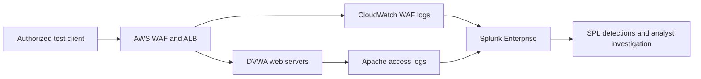
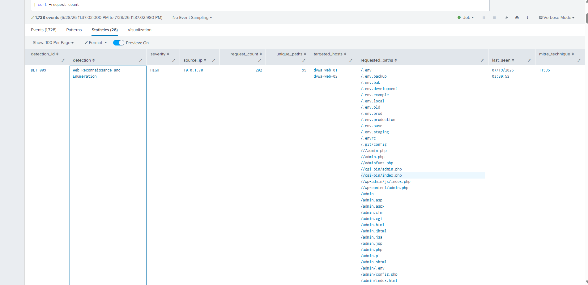
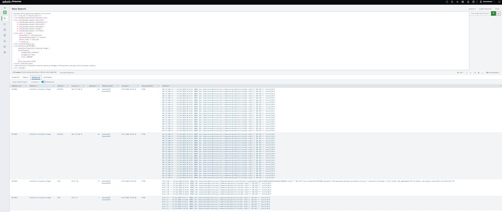
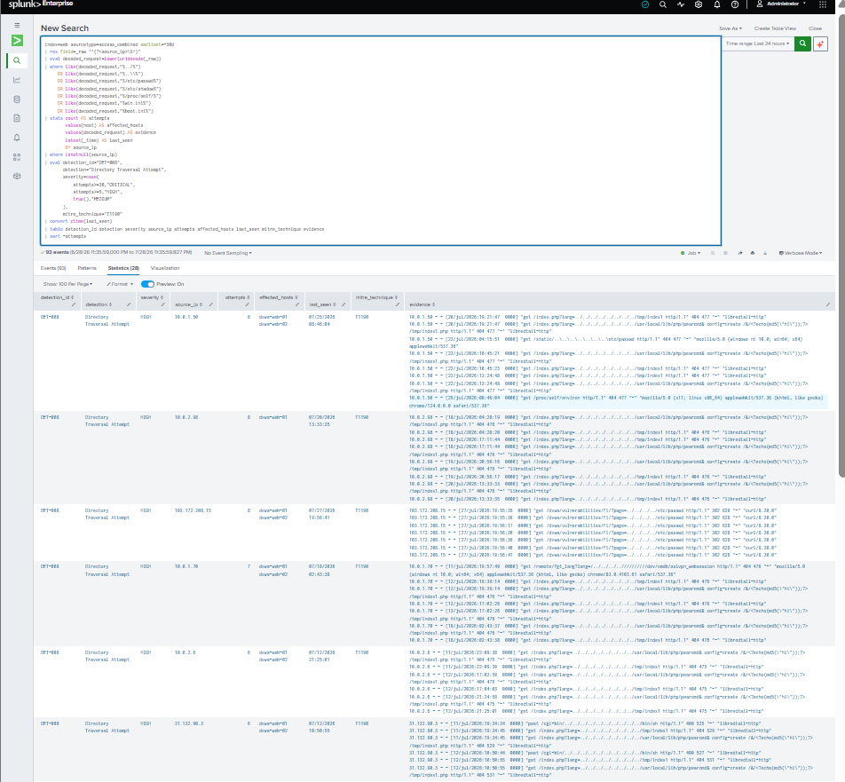
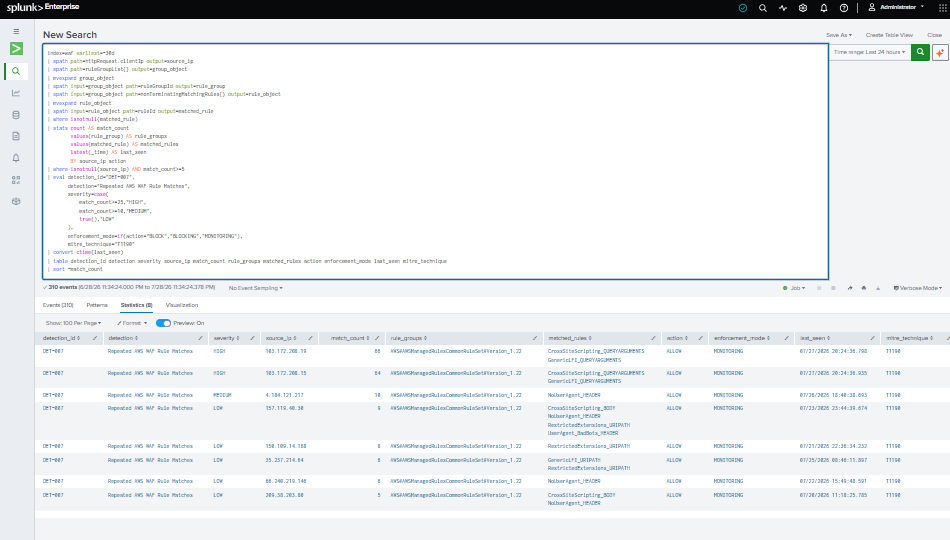

# Incident Case Study: Coordinated Web Application Attack Simulation

## Document Control

| Field | Value |
|---|---|
| Incident ID | LAB-INC-001 |
| Classification | Authorized security validation |
| Environment | AWS cloud security lab |
| Severity | High |
| Status | Closed — detection objectives validated |
| Primary assets | Application Load Balancer, DVWA web servers |
| Investigation platform | Splunk Enterprise |
| Telemetry | Apache access logs, AWS WAF logs, VPC Flow Logs |
| MITRE ATT&CK | T1595 — Active Scanning; T1190 — Exploit Public-Facing Application |

> This case study documents a controlled attack simulation against infrastructure owned for security testing. It does not describe an unauthorized intrusion or a confirmed production compromise.

## Executive Summary

A controlled web-attack sequence was performed against a deliberately vulnerable application hosted on two Ubuntu EC2 instances behind an AWS Application Load Balancer. The sequence included reconnaissance, SQL injection, cross-site scripting, and directory-traversal requests.

AWS WAF inspected the inbound requests, Apache recorded application-level activity, and Splunk centralized the resulting telemetry. Custom SPL detections identified the reconnaissance and exploit patterns and provided the evidence required to investigate the activity across both web servers.

The exercise demonstrated that the monitoring pipeline could:

- Identify suspicious request patterns at the application layer.
- Extract and correlate source, target, request, rule and time context.
- Show AWS WAF managed-rule matches alongside Apache activity.
- Distinguish security-control observation from confirmed exploitation.
- Support an analyst-led investigation without automatic containment.

No sensitive data was used, no persistence was established, and no evidence of unintended system compromise was observed.

## Architecture Context



The Application Load Balancer distributed requests between both DVWA servers. AWS WAF operated in monitoring/count mode during parts of the test, so a managed-rule match indicated inspection activity but did not always mean the request was blocked.

For the complete platform design, see the [project architecture](../architecture/aws-soc-architecture-3d.png).

## Incident Scenario

The authorized test followed a realistic external web-attack progression:

1. The test client requested commonly enumerated paths.
2. SQL injection strings were submitted to a DVWA endpoint.
3. Encoded reflected-XSS payloads were submitted.
4. Encoded directory-traversal patterns were requested.
5. The requests were repeated to generate AWS WAF managed-rule matches.
6. Splunk detections were executed against the centralized telemetry.
7. The analyst reviewed the source, request, targeted hosts and WAF context.

The scenario was intentionally limited to detection validation. No destructive payload, credential theft, persistence, data exfiltration or automated blocking was performed.

## Detection Chain

| Sequence | Detection | Purpose | Primary evidence |
|---:|---|---|---|
| 1 | DET-009 — Web Reconnaissance and Enumeration | Identify requests to multiple commonly enumerated paths | Apache access logs |
| 2 | DET-002 — SQL Injection Attempt | Detect URL-decoded SQLi indicators | Apache access logs |
| 3 | DET-003 — Cross-Site Scripting Attempt | Detect script and event-handler indicators | Apache access logs |
| 4 | DET-008 — Directory Traversal Attempt | Detect traversal sequences and sensitive paths | Apache access logs |
| 5 | DET-007 — Repeated AWS WAF Rule Matches | Identify repeated managed-rule matches from a source | AWS WAF logs |

The complete detection logic is available in the [`detections/`](../detections/) directory.

## Investigation Timeline

The table uses relative time because the exercise was repeated during multiple validation windows. This avoids presenting one laboratory timestamp as a production incident timeline.

| Relative time | Activity | Evidence | Analyst interpretation |
|---|---|---|---|
| T+00 | Requests sent to common administrative and sensitive paths | DET-009 | Reconnaissance and application mapping |
| T+05 | Encoded SQL injection request observed | DET-002 | Attempt to exploit a public-facing application |
| T+10 | Encoded XSS request observed | DET-003 | Client-side injection attempt |
| T+15 | Directory-traversal request observed | DET-008 | Attempt to access unintended files or paths |
| T+20 | Repeated managed-rule matches recorded | DET-007 | Multiple suspicious requests associated with WAF rules |
| T+25 | Analyst correlated the source, requests and targeted hosts | Splunk investigation | Related activity treated as one investigation |
| T+35 | Test stopped and evidence reviewed | Lab validation record | No confirmed persistence, exfiltration or unintended impact |

## Investigation Workflow

### 1. Validate the alert

The analyst confirmed that each result:

- Used the expected index and sourcetype.
- Contained the correct detection ID.
- Fell within the authorized test window.
- Included sufficient source, target and request context.
- Was not caused by an ingestion or field-extraction error.

### 2. Establish scope

Apache data was reviewed to determine:

- Which source generated the activity.
- Which web servers received requests through the ALB.
- Which paths and payload categories were requested.
- Whether requests were repeated.
- Whether the activity moved beyond enumeration into exploitation attempts.

AWS WAF data was reviewed to determine:

- Which managed rules matched.
- Whether WAF recorded `COUNT`, `ALLOW` or `BLOCK`.
- Whether one source matched multiple rule categories.
- Whether the WAF evidence aligned with the Apache request timeline.

### 3. Assess potential impact

The investigation looked for signs that would increase severity:

- Successful access to sensitive files
- Unexpected server errors following exploit attempts
- New processes, accounts or persistence
- Suspicious outbound connections
- Credential use after the web activity
- Evidence of data access or exfiltration

The available evidence showed suspicious and intentionally malicious requests, but did not prove a successful compromise outside the expected DVWA behavior.

### 4. Determine disposition

The activity was classified as:

```text
TRUE POSITIVE — AUTHORIZED SECURITY TEST
```

This means the detections correctly identified malicious behavior, while the business disposition remained authorized laboratory validation.

## Key Findings

| Finding | Risk | Impact if observed in production | Recommended action |
|---|---|---|---|
| Multiple suspicious paths requested by one source | Medium | Application mapping could precede exploitation | Rate-limit, investigate source and review exposed paths |
| SQL injection indicators in HTTP requests | High | Data exposure, authentication bypass or application compromise | Block payloads, remediate vulnerable queries and review database activity |
| XSS indicators in HTTP requests | High | Session theft, malicious browser actions or content manipulation | Apply output encoding, CSP and WAF protections |
| Directory-traversal indicators | High | Disclosure of configuration, credentials or operating-system files | Normalize paths, enforce allowlists and review response behavior |
| Repeated WAF managed-rule matches | Medium–High | Sustained exploitation attempts or automated scanning | Correlate rule categories, tune rate limits and consider blocking |
| WAF count/monitoring behavior | Control gap | Suspicious requests may reach the application | Validate rules before progressively enabling block mode |

## Risk Assessment

### Likelihood

**High** for attempted exploitation of an internet-facing vulnerable application. Automated scanning and common payloads are routinely directed at publicly accessible services.

### Potential impact

**High** if equivalent vulnerabilities existed in a production application. Successful exploitation could affect confidentiality, integrity and service availability.

### Observed lab impact

**Low and controlled.** Activity was limited to an intentionally vulnerable application in an authorized lab. No evidence indicated unintended persistence, lateral movement or exfiltration.

### Overall incident severity

**High for detection triage; authorized test for business disposition.**

This distinction allows the SOC to preserve realistic security severity without reporting the lab exercise as an unauthorized breach.

## Response Actions

### Actions performed in the lab

- Stopped the test after the required telemetry was generated.
- Confirmed that both web servers remained available.
- Reviewed Apache and WAF events in Splunk.
- Validated the relevant custom SPL detections.
- Recorded sanitized evidence.
- Kept containment decisions under analyst control.

### Recommended production response

If this activity were unauthorized, the response plan would include:

1. Add a temporary WAF block or rate-based rule for the confirmed malicious source.
2. Preserve WAF, ALB, Apache, authentication and network evidence.
3. Review application and database logs for successful exploitation.
4. Isolate or remove an affected instance from the target group if compromise is suspected.
5. Patch the vulnerable application and validate input-handling controls.
6. Rotate exposed credentials or sessions if access is suspected.
7. Hunt for persistence, lateral movement and suspicious outbound traffic.
8. Re-enable the workload only after remediation and validation.

No automated containment was implemented in this project. Production response actions should require approval, documented scope and rollback planning.

## Root Cause and Contributing Factors

### Root cause

The application was deliberately vulnerable by design. DVWA was selected to generate realistic web-security telemetry.

### Contributing factors

- Internet-reachable application entry point
- WAF monitoring/count configuration during testing
- Common vulnerable endpoints exposed by DVWA
- Repeated attack requests required for threshold testing
- Laboratory thresholds not yet baselined for production traffic

These conditions are appropriate for a controlled security lab but would require remediation and stronger preventive controls in production.

## Evidence

All screenshots must remain sanitized before public release.

<details>
<summary>DET-009 — Reconnaissance evidence</summary>



</details>

<details>
<summary>DET-002 — SQL injection evidence</summary>


</details>

<details>
<summary>DET-003 — XSS evidence</summary>



</details>

<details>
<summary>DET-008 — Directory-traversal evidence</summary>



</details>

<details>
<summary>DET-007 — AWS WAF evidence</summary>



</details>

For test boundaries and per-rule validation status, see the [Detection Validation Report](detection-validation.md).

## Lessons Learned

- Apache and AWS WAF logs provide complementary visibility; neither source alone tells the complete story.
- URL decoding is required before matching many encoded web payloads.
- A WAF match is not proof that a request was blocked or that exploitation succeeded.
- Detection severity and incident disposition should be recorded separately.
- Evidence quality matters: screenshots must show the search, time range, result and key investigation fields.
- Lab thresholds must be baselined before production use.
- Analyst approval should remain mandatory until response automation is thoroughly tested.

## Follow-Up Actions

| Action | Priority | Status |
|---|---|---|
| Replace or remove intentionally vulnerable applications in production | Critical | Not applicable to lab |
| Test WAF rules in count mode before enabling block mode | High | Demonstrated |
| Add approved-scanner and testing-window lookups | Medium | Planned |
| Add HTTP status and response-size context to web detections | Medium | Planned |
| Add ALB access logs for stronger request-path correlation | Medium | Future improvement |
| Define evidence-retention and case-number standards | Medium | Documented in project |
| Build automated SPL validation in CI | Medium | Future improvement |

## Final Assessment

The exercise validated a practical cloud SOC workflow from telemetry generation through detection and analyst investigation. The platform identified reconnaissance and multiple web-exploitation techniques across Apache and AWS WAF data while preserving a clear distinction between suspicious requests, preventive-control behavior and confirmed impact.

The strongest outcome was not simply that alerts fired. The exercise demonstrated how an analyst can use multiple data sources to establish scope, assess risk, avoid overstating impact and document a defensible incident disposition.
