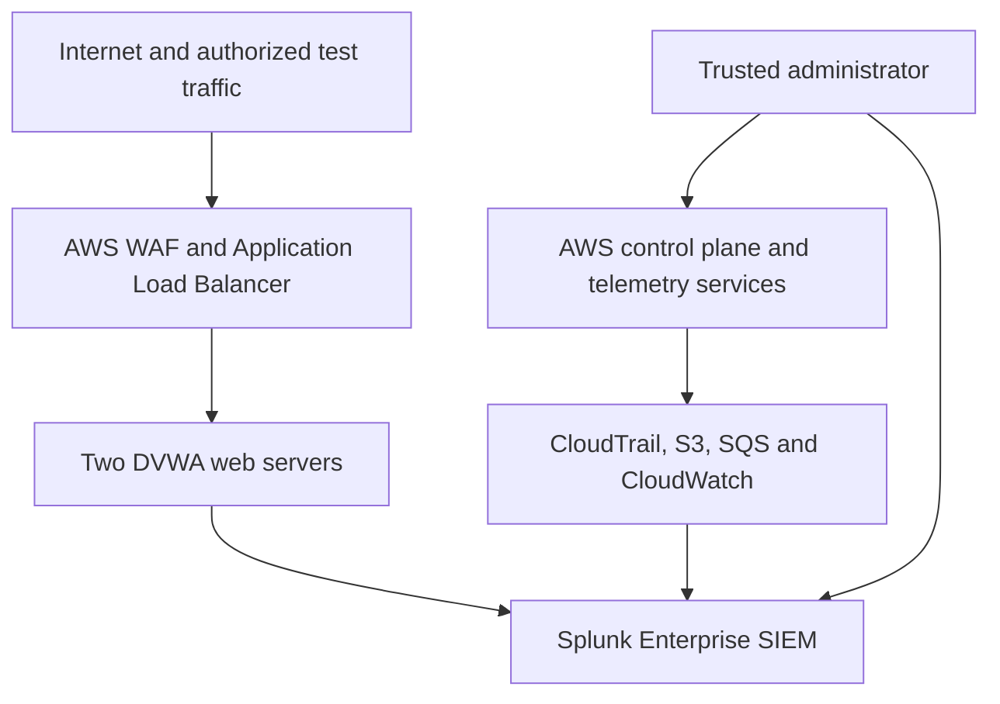

# Threat Model — Enterprise Cloud Security Monitoring Platform

## Document Control

| Field | Value |
|---|---|
| System | Enterprise Cloud Security Monitoring Platform |
| Environment | Controlled AWS security lab |
| Methodology | STRIDE with qualitative risk assessment |
| Primary region | AWS Asia Pacific (Mumbai), `ap-south-1` |
| Review trigger | Architecture, IAM, exposure, logging, or detection changes |
| Intended audience | Cloud security engineers, SOC analysts, detection engineers, and reviewers |

## 1. Purpose

This threat model evaluates the security risks associated with the AWS-based SOC lab and documents the controls used to reduce those risks. It focuses on the internet-facing DVWA environment, AWS control plane, centralized Splunk SIEM, and supporting logging pipelines.

The environment is intentionally vulnerable for authorized detection testing. The objective is therefore not to claim production readiness, but to demonstrate how risk can be identified, monitored, validated, and reduced through layered controls.

## 2. Scope

### In Scope

- AWS account, IAM roles, and control-plane activity
- Application Load Balancer and AWS WAF
- Two Ubuntu EC2 web servers hosting Apache and DVWA
- Splunk Enterprise EC2 instance
- Splunk Universal Forwarders
- AWS CloudTrail, Amazon S3, and Amazon SQS
- VPC Flow Logs and CloudWatch Logs
- Security groups, instance metadata, and administrative access
- Security dashboards, SPL detections, scheduled alerts, and investigation evidence

### Out of Scope

- Production workloads and customer data
- Corporate identity providers and enterprise SSO
- Endpoint detection and response platforms
- Production high availability and disaster recovery
- Automated containment or destructive response actions
- GuardDuty, which was excluded from the current lab implementation

## 3. System and Trust Boundaries

| Boundary | Transition | Primary concern | Existing control |
|---|---|---|---|
| TB-01 | Internet → WAF/ALB | Malicious or high-volume web requests | AWS WAF managed rules, ALB security group, web logging |
| TB-02 | ALB → Web EC2 | Direct backend access or forged traffic | Web security group accepts HTTP only from the ALB security group |
| TB-03 | Web EC2 → Splunk | Forged, lost, or intercepted telemetry | Restricted Splunk receiving port and host-based forwarders |
| TB-04 | AWS services → Logging pipeline | Log deletion, modification, or ingestion failure | CloudTrail, encrypted S3, versioning, SQS, monitoring queries |
| TB-05 | Administrator → AWS/Splunk | Credential theft or excessive privilege | Restricted administrator CIDR, IAM roles, least-privilege guidance |
| TB-06 | EC2 → Instance metadata | Credential theft through SSRF | IMDSv2 enforcement |

## 4. Critical Assets

| Asset | Security objective | Business/security impact if compromised |
|---|---|---|
| AWS account and IAM identities | Confidentiality, integrity, accountability | Unauthorized infrastructure changes, persistence, or privilege escalation |
| CloudTrail audit records | Integrity, availability, non-repudiation | Reduced ability to investigate AWS activity |
| Splunk indexes and detections | Integrity, availability | Missed alerts, false conclusions, or investigation delays |
| Splunk administrative account | Confidentiality, integrity | Search manipulation, data deletion, or monitoring disruption |
| Web EC2 instances | Integrity, availability | Web compromise, lateral movement, or malicious hosting |
| S3 log bucket | Confidentiality, integrity, availability | Disclosure, tampering, or loss of audit evidence |
| SQS notification queue | Integrity, availability | Delayed or missing CloudTrail ingestion |
| WAF and security groups | Integrity | Unintended public exposure or ineffective filtering |
| Terraform configuration | Integrity, confidentiality | Repeatable deployment of insecure infrastructure or secret leakage |

## 5. STRIDE Analysis

| Category | Example threat | Affected components | Preventive/detective controls | Residual risk |
|---|---|---|---|---|
| Spoofing | Stolen AWS, SSH, or Splunk credentials | IAM, EC2, Splunk | Restricted administrator CIDR, IAM roles, authentication monitoring, SSH detections | Medium |
| Tampering | Modification of CloudTrail, WAF, security groups, forwarders, or SPL logic | AWS control plane, logging pipeline, SIEM | CloudTrail monitoring, S3 versioning, IAM restrictions, DET-004 to DET-006, Git history | Medium |
| Repudiation | User denies an administrative or security-sensitive action | IAM, EC2, Splunk | Multi-region CloudTrail, Linux authentication logs, Splunk event timestamps | Low–Medium |
| Information disclosure | Public log bucket, exposed Splunk UI, sensitive values in logs, or metadata theft | S3, Splunk, EC2 | S3 public-access block, encryption, WAF log redaction, restricted ports, IMDSv2 | Medium |
| Denial of service | Request flooding, SIEM resource exhaustion, or excessive telemetry volume | WAF, ALB, web EC2, Splunk | ALB, WAF visibility, ingestion monitoring, paused on-demand VPC Flow ingestion | Medium–High |
| Elevation of privilege | IAM policy abuse, exposed management interface, or web-to-cloud credential access | IAM, Splunk, EC2 | Least-privilege roles, IMDSv2, security groups, CloudTrail detections | Medium |

## 6. Priority Attack Paths

### AP-01 — Internet Exploitation and Lateral Movement

1. An attacker sends SQL injection, XSS, traversal, reconnaissance, or malicious HTTP requests.
2. The request reaches AWS WAF and the ALB.
3. Because DVWA is intentionally vulnerable, successful exploitation may affect a web server.
4. The attacker attempts credential theft, persistence, or lateral movement.
5. Apache, Linux, WAF, and VPC telemetry is correlated in Splunk.

**Relevant controls:** DET-002, DET-003, DET-007, DET-008, DET-009, WAF managed rules, ALB-only backend access, IMDSv2.

### AP-02 — IAM Privilege Escalation and Defense Evasion

1. An AWS credential is compromised.
2. The attacker attaches a privileged policy or modifies an IAM role.
3. The attacker attempts to disable CloudTrail or alter security monitoring.
4. CloudTrail events are delivered through S3/SQS and analyzed in Splunk.

**Relevant controls:** DET-004, DET-005, least-privilege IAM roles, multi-region CloudTrail, S3 versioning.

### AP-03 — Public Exposure Through Security-Group Modification

1. A user or compromised identity modifies an ingress rule.
2. SSH, Splunk Web, or another management service becomes internet-accessible.
3. External hosts scan or attempt authentication.
4. CloudTrail and Linux authentication detections identify the activity.

**Relevant controls:** DET-001, DET-006, DET-010, restricted `admin_cidr`, security-group review.

### AP-04 — Monitoring Pipeline Disruption

1. A log source, forwarder, SQS notification, or Splunk input stops working.
2. Security events are no longer ingested or are delayed.
3. The log-source health dashboard identifies stale or delayed telemetry.
4. The analyst validates the AWS source, transport, Splunk input, index, and latest event time.

**Relevant controls:** Log Source Health dashboard, CloudTrail/S3/SQS monitoring, source-specific validation searches.

## 7. Risk Register

| ID | Risk | Likelihood | Impact | Existing controls | Residual rating | Recommendation |
|---|---|---:|---:|---|---|---|
| R-01 | DVWA exploitation leads to web-host compromise | High | High | Isolated lab, WAF visibility, ALB, detections | High | Keep the lab isolated, ephemeral, and free of real data |
| R-02 | Splunk management interface is exposed or compromised | Medium | High | Restricted `admin_cidr`, authentication | Medium | Add TLS, stronger identity controls, and private administrative access |
| R-03 | AWS credentials are stolen or over-privileged | Medium | Critical | IAM roles, IMDSv2, CloudTrail | Medium–High | Enforce MFA, short-lived sessions, permission boundaries, and periodic access reviews |
| R-04 | CloudTrail evidence is modified or deleted | Low–Medium | Critical | S3 encryption, versioning, bucket policy, DET-005 | Medium | Add Object Lock in a dedicated audit account for production use |
| R-05 | WAF count mode observes but does not block malicious traffic | High | High | Managed-rule visibility, WAF detections | High | Tune with evidence, then move validated rules from count to block |
| R-06 | Excessive telemetry exhausts the single-node SIEM | High | Medium | On-demand VPC Flow ingestion and health monitoring | Medium | Add filtering, retention controls, capacity planning, and scalable indexers |
| R-07 | Logs contain credentials, tokens, or personal information | Medium | High | WAF header redaction and restricted log access | Medium | Add ingestion-time masking and a formal data-retention policy |
| R-08 | Public-subnet design increases attack surface | Medium | High | Security groups and ALB-only backend HTTP | Medium–High | Move workloads to private subnets and use SSM or a controlled access tier |
| R-09 | Single Splunk instance creates a monitoring failure point | Medium | High | Source health dashboard and EC2 monitoring | Medium–High | Use backup, recovery testing, and a distributed Splunk architecture |
| R-10 | Terraform misconfiguration is merged into the repository | Medium | High | Terraform validation and Checkov GitHub Actions workflow | Medium | Review findings and later enforce selected high-confidence policies |

## 8. Security Control Mapping

| Control objective | Implementation | Evidence |
|---|---|---|
| Restrict internet exposure | ALB, security groups, trusted administrator CIDR | Terraform security-group configuration |
| Protect instance credentials | IMDSv2 and IAM instance roles | Terraform EC2 metadata and IAM configuration |
| Preserve AWS audit activity | Multi-region CloudTrail, encrypted and versioned S3 | `cloudtrail` index and CloudTrail validation |
| Monitor application attacks | Apache logs and AWS WAF telemetry | DET-002, DET-003, DET-007 to DET-009 |
| Monitor authentication abuse | Linux authentication logs | DET-001 and DET-010 |
| Detect cloud-control changes | CloudTrail SPL analytics | DET-004 to DET-006 |
| Identify telemetry gaps | Log Source Health dashboard | Healthy, delayed, and stale status evidence |
| Validate infrastructure code | GitHub Actions, Terraform validation, Checkov | Successful Terraform Security Checks run |

## 9. Assumptions and Limitations

- DVWA is intentionally vulnerable and must never contain real credentials, customer data, or production secrets.
- AWS WAF initially operates in count/monitoring mode to support tuning and evidence collection.
- The lab uses public subnets to reduce complexity and cost; production workloads should use private subnets.
- TLS, enterprise SSO, immutable cross-account logging, high availability, and automated recovery are not implemented.
- Splunk is deployed as a single-node lab SIEM and is not sized for continuous high-volume production ingestion.
- VPC Flow Logs remain available in AWS, but continuous Splunk ingestion may be paused to control lab volume.
- Synthetic searches validate selected detection logic without performing destructive AWS actions.
- Security thresholds are lab baselines and require production-specific tuning.

## 10. Recommended Security Roadmap

1. Move EC2 workloads into private subnets and use AWS Systems Manager Session Manager.
2. Add TLS for the ALB and Splunk administrative interface.
3. Enforce MFA, short-lived federation, permission boundaries, and access reviews.
4. Move audit logs to a dedicated security account with immutable retention.
5. Review WAF count-mode evidence and promote tested rules to block mode.
6. Add centralized secrets management and ingestion-time sensitive-data masking.
7. Introduce scalable Splunk indexing, backups, and recovery testing.
8. Convert selected Checkov findings into blocking pull-request policies.
9. Review the threat model after every material architecture or trust-boundary change.

## 11. Review and Acceptance

This threat model documents the current lab design and its known residual risks. A green CI result or successful detection test does not prove that the environment is secure. Risk acceptance must be based on the intended use of the environment, the sensitivity of its data, and the effectiveness of operational controls.

